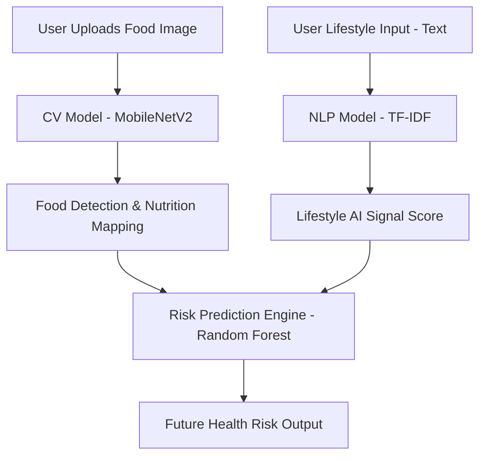

# FoodMed AI 🥗🗣️📊

**FoodMed AI** is an internship-level multimodal health intelligence system that combines Computer Vision (CV) and Natural Language Processing (NLP) to predict future metabolic health risks.

## 🚀 Key Innovation: Multimodal AI
Unlike standard food detectors, **FoodMed AI** understands both visual data (what you eat) and linguistic data (how you live).

- **📸 Computer Vision Module**: Uses **MobileNetV2** (Deep Learning) to classify food images into categories like Pizza, Burger, Salad, etc.
- **🗣️ NLP Module**: Uses **TF-IDF Vectorization** to analyze user lifestyle descriptions (e.g., "I eat sweets daily and feel tired").
- **🧠 Predictive ML Module**: A **Random Forest Classifier** that takes inputs from both CV and NLP layers to output a metabolic risk score.

## 🏗️ System Architecture

## 🛠️ Tech Stack
- **Deep Learning**: TensorFlow, MobileNetV2
- **NLP**: NLTK, Scikit-Learn (TF-IDF)
- **Machine Learning**: Scikit-Learn (Random Forest)
- **Data & Viz**: Pandas, NumPy, Matplotlib
- **Platform**: Google Colab / Jupyter

## 📁 Project Contents
- `FoodMed_AI.ipynb`: The primary multimodal notebook.
- `health_data.csv`: Enhanced dataset with lifestyle features for training.

## 🪪 Resume Impact
> **FoodMed AI**: Developed a multimodal AI system combining computer vision and NLP to predict long-term health risks from food habits and lifestyle inputs. Optimized using MobileNetV2 and Scikit-Learn.

## 🎤 60-Second Pitch
> "FoodMed AI is a multimodal health intelligence system that combines image understanding and lifestyle language analysis to predict future metabolic risk using machine learning. It bridges the gap between passive food tracking and active diagnostic insights."
# FoodMedAI
